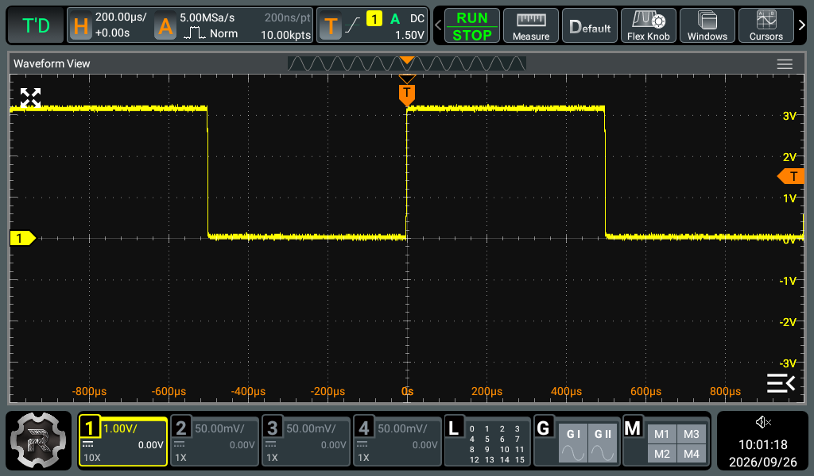
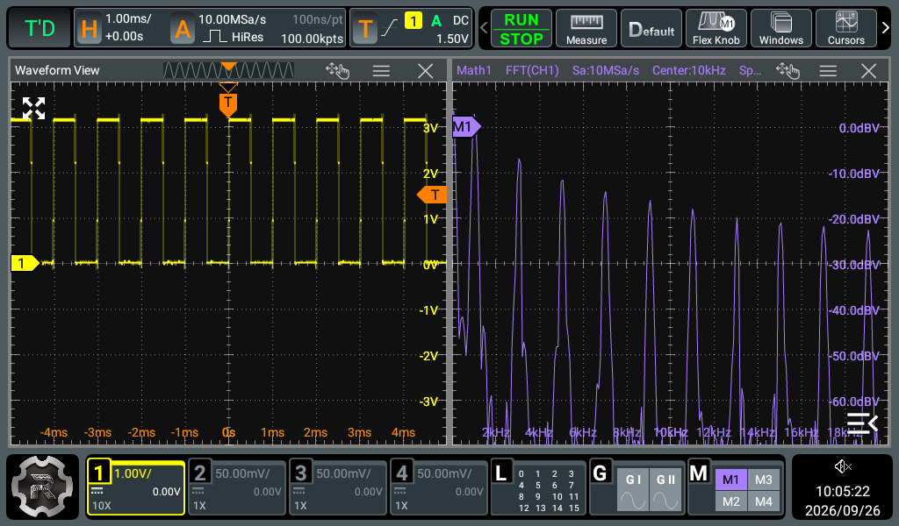

# RIGOL MHO98 MCP

RIGOL MHO98をUSB経由で操作するMCPサーバーです。MCP対応のAIクライアントから、オシロスコープの設定変更、波形・測定値の取得、FFT、通信デコードなどを扱えます。

実験中の操作を短くするため、設定の送信と測定を分けています。設定変更のたびに全設定を読み直したり、確認用の通信を追加したりしません。

## 実機の画面

以下は、CH1にプローブを接続し、本体の **PROBE COMP** 信号を入力して、このMCPの `screenshot` で取得した画面です。撮影日：2026-09-26。

### 矩形波を表示する

CH1を1 V/div、時間軸を200 µs/divに設定した表示例です。約1 ms周期の矩形波が見えます。



### 同じ信号をFFTで見る

MATH1の入力をCH1にして、Hann窓・dBV表示・0〜20 kHzでFFTを表示した例です。約1 kHzの基本波と高調波が見えます。撮影時の取得設定はHiRes・100 kポイントです。



## できること

現在、MHO98向けに **90ツール**を登録しています。

| 用途 | 主な機能 |
| --- | --- |
| 入力・取り込み | CH1〜4、時間軸、トリガ、取得メモリ長、ハイレゾ、平均化 |
| 数値測定 | 振幅・周波数・時間差・位相・統計、DVM、カウンタ、カーソル |
| 波形の取得 | 波形データ取得、CSV出力、スクリーンショット |
| 演算・解析 | FFT、MATH演算、ヒストグラム、マスク、イベント検索 |
| 通信デコード | I2C、SPI、RS232、Parallel、CAN、LIN、IIS、FlexRay、MIL-STD-1553 |
| 信号発生 | 波形・周波数・振幅・変調・出力ON/OFF、Bode設定 |
| その他 | デジタル入力、波形記録、参照波形、保存・読込み、表示設定 |

通信デコードや信号発生などは、本体に搭載された機能・オプションに依存します。接続して実際に確認した機器はMHO98です。

## 会話での操作例

MCPを登録したクライアントから、例えば次のように依頼できます。

```text
CH2〜4をOFFにして、CH1をFFTで表示して。
取得メモリ長を100 kポイントにして。
ハイレゾモードを16 bitにして。
CH1のDVMをDC測定でONにして。
CH1の周波数とピーク・ツー・ピーク値を取得して。
CH1の波形をCSVに保存して。
```

ツールは設定の送信結果と測定値を区別して返します。例えば `sent: true, verified: false` は、コマンドを送信したことを表します。本体の状態を確認したという意味ではありません。

## 設定の扱い

### 通常のCH設定は全項目を指定

`set_channel` は、対象CHに加えて以下の11項目を必須にしています。帯域制限などが以前の状態のまま残るのを避けるためです。

- 表示ON/OFF、帯域制限、反転、AC/DC/GND結合
- 縦軸スケール、オフセット、チャンネル間スキュー、微調整
- ラベル表示、ラベル文字列、バイアス

不足がある呼出しは、オシロスコープに送る前に拒否します。値の確認のために本体を読みに行く処理はありません。

### 接続条件に依存する3項目は人が決める

**入力インピーダンス・測定単位・プローブ倍率**は、通常のCH設定に含めません。実機で人が設定するか、人が明示的に指示した場合だけ `set_channel_input` で変更します。

例えば「ACにして」という依頼から、AIが勝手に50 Ωを1 MΩに変更する扱いにはしていません。50 Ω入力はDC結合に限られるため、こうした条件の衝突は依頼者に伝えます。

### 読取りは結果に必要なものだけ

測定値を解釈するための測定元・モード・単位、波形を換算するためのプリアンブルなどは取得します。設定変更の前後の照合、自動エラー照会、自動再試行は行いません。診断が必要なときは専用の読取りツールを明示的に使います。

## セットアップ

### 1. インストール

Python 3.13とuvを使う構成です。

```bash
git clone https://github.com/kitour/rigol-mho98-mcp.git
cd rigol-mho98-mcp
uv sync
```

リポジトリが非公開の場合、cloneにはアクセスできるGitHubアカウントが必要です。

### 2. USBで接続

PCとMHO98をUSBで接続し、MHO98用の実行ファイルを起動します。

```bash
RIGOL_USB=1 \
RIGOL_USB_SERIAL=YOUR_MHO98_SERIAL \
RIGOL_OUTPUT_DIR=/absolute/path/to/output \
.venv/bin/rigol-mho98
```

`YOUR_MHO98_SERIAL` は接続する本体のシリアル番号に置き換えてください。起動後は標準入出力でMCPクライアントと通信するため、単独で起動しても対話画面は表示されません。

### 3. MCPクライアントに登録

クライアントの設定形式に合わせて、次の実行ファイルと環境変数を指定します。

| 項目 | 値 |
| --- | --- |
| 実行ファイル | `/absolute/path/to/rigol-mho98-mcp/.venv/bin/rigol-mho98` |
| `RIGOL_USB` | `1` |
| `RIGOL_USB_SERIAL` | 接続するMHO98のシリアル番号 |
| `RIGOL_OUTPUT_DIR` | 画像・CSVなどの保存先の絶対パス |

MHO98用のエントリーポイントは **`rigol-mho98`** です。ソースを更新した後は、クライアント側のMCP接続を再起動すると変更が反映されます。

## 構成と資料

- [`src/rigol_mcp/mho98/`](src/rigol_mcp/mho98/) — MHO98向けの実装
- [`src/rigol_mcp/mho98/data/`](src/rigol_mcp/mho98/data/) — SCPI実行用の構文・型・静的範囲
- [`docs/FAST_OPERATIONS.md`](docs/FAST_OPERATIONS.md) — 通信と設定の設計
- [`docs/FEATURE_TRIAL.md`](docs/FEATURE_TRIAL.md) — 実機で試した機能の記録
- [`docs/features/`](docs/features/) — 機能別の実装メモ

このリポジトリは開発中のスナップショットです。古いテスト・試験記録には変更前の仕様を扱うものもあります。現在の操作方針はこのREADMEと `FAST_OPERATIONS.md` を参照してください。
